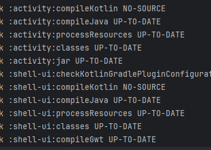

# Test

* test1
    * test2
* test3
* test4




1. 테스트1
2. 테스트2
3. 테스트3


```kotlin
  @Bean
    fun securityFilterChain(http: ServerHttpSecurity): SecurityWebFilterChain = http {
        csrf { disable() }
        httpBasic { disable() }
        formLogin { disable() }
        headers { frameOptions { mode = XFrameOptionsServerHttpHeadersWriter.Mode.SAMEORIGIN } }
        oauth2Login {
            securityContextRepository = NoOpServerSecurityContextRepository.getInstance()
            authenticationSuccessHandler = ServerAuthenticationSuccessHandler { filter, authentication ->
                val exchange = filter.exchange
                val provider = exchange.request.path.value().split("/").last()
                val principal = authentication.principal as OAuth2User
                tokenPublisher.publish(provider, principal).flatMap { token -> exchange.sendAuthenticationCookie(token) }
            }
        }

```
